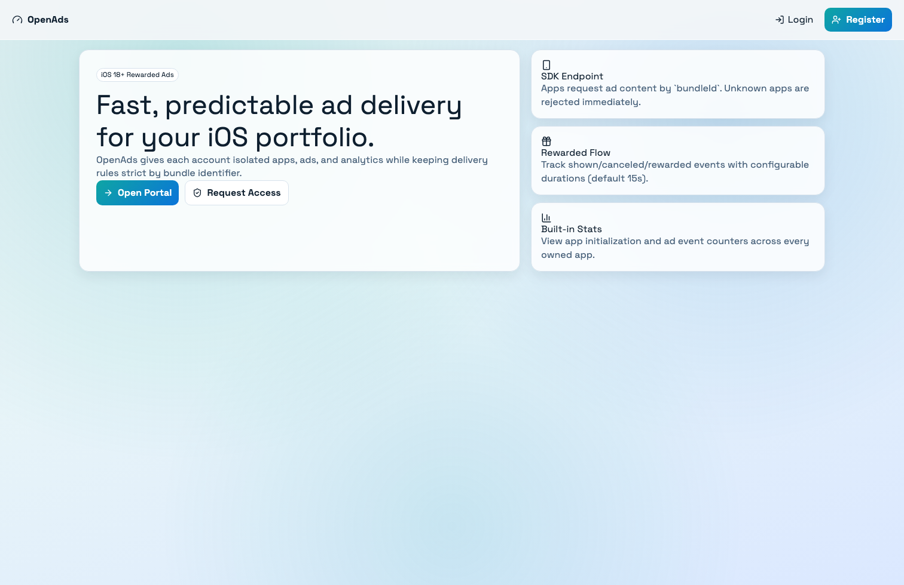
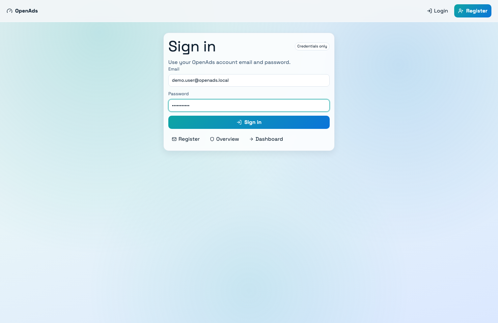
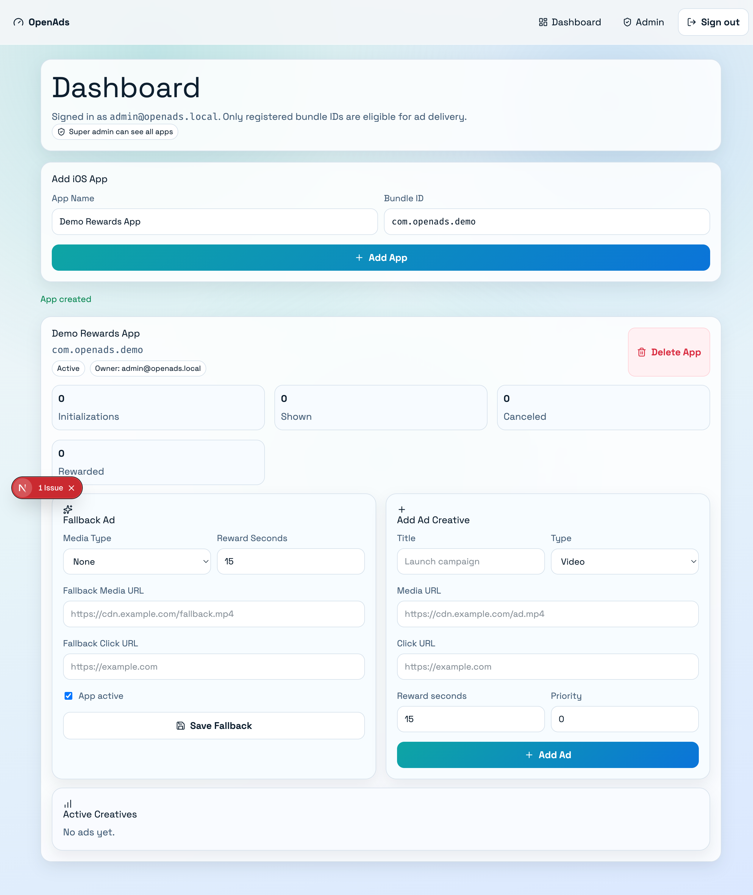
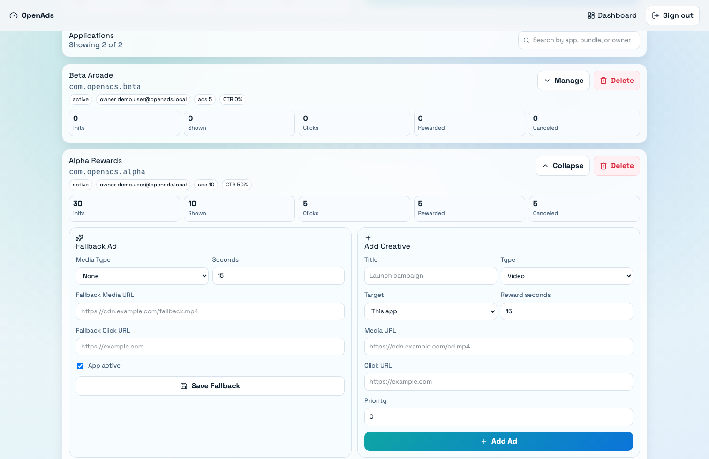
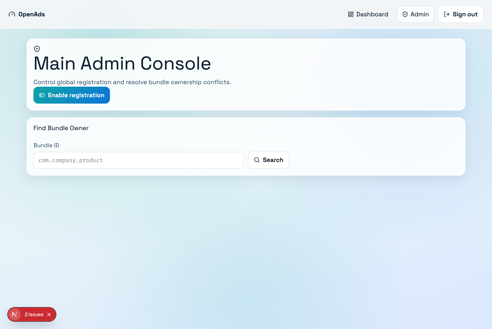
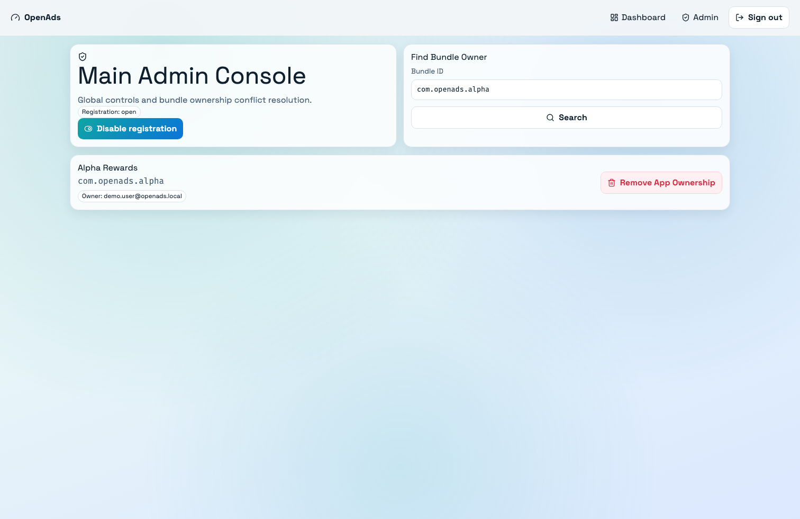
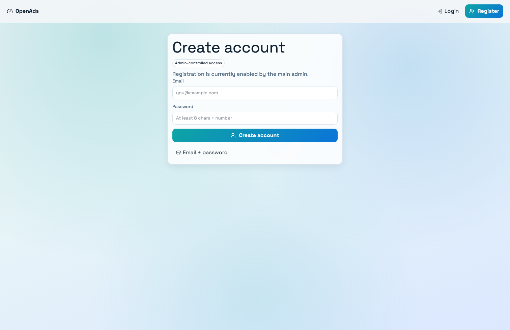
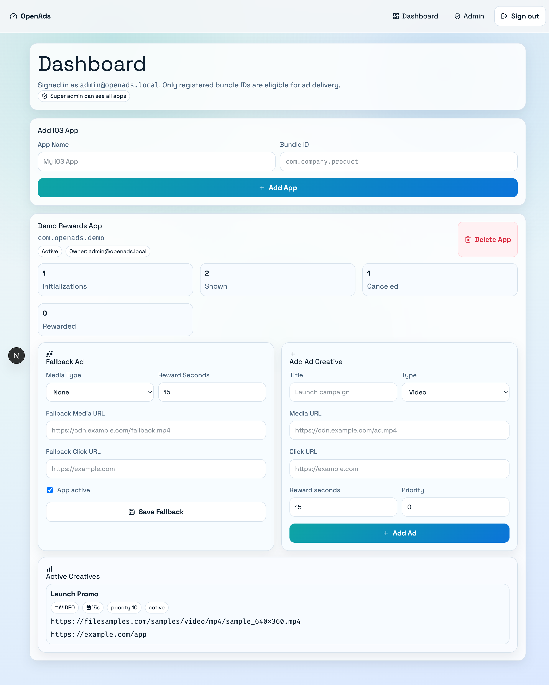

# OpenAds

OpenAds is a Next.js + TypeScript ad platform for iOS 18+ apps.

## Showcase

Click any preview to open the full-size image.

<table>
  <tr>
    <td align="center">
      <a href="./screenshots/01-landing.png"></a>
    </td>
    <td align="center">
      <a href="./screenshots/02-login.png"></a>
    </td>
    <td align="center">
      <a href="./screenshots/03-dashboard.png"></a>
    </td>
  </tr>
  <tr>
    <td align="center">Landing</td>
    <td align="center">Login (filled)</td>
    <td align="center">Dashboard (filled)</td>
  </tr>
  <tr>
    <td align="center">
      <a href="./screenshots/04-dashboard-with-ad.png"></a>
    </td>
    <td align="center">
      <a href="./screenshots/05-admin.png"></a>
    </td>
    <td align="center">
      <a href="./screenshots/06-admin-search.png"></a>
    </td>
  </tr>
  <tr>
    <td align="center">Dashboard Creative View</td>
    <td align="center">Admin Console</td>
    <td align="center">Admin Search Result</td>
  </tr>
  <tr>
    <td align="center">
      <a href="./screenshots/07-register-open.png"></a>
    </td>
    <td align="center">
      <a href="./screenshots/08-dashboard-stats.png"></a>
    </td>
    <td></td>
  </tr>
  <tr>
    <td align="center">Register (open)</td>
    <td align="center">Dashboard Stats</td>
    <td></td>
  </tr>
</table>

It provides:
- A web portal for users and super admin
- Credentials auth (email/password)
- Registration toggle controlled by super admin
- Per-user app ownership with unique system-wide bundle IDs
- Ad scope support: app-only or all-owned-apps
- Rewarded ad delivery API for iOS SDK clients
- Event tracking (init, shown, canceled, rewarded, clicked)
- Aggregated app statistics
- Swift Package SDK with offline fallback support

## Tech Stack

- Next.js App Router (TypeScript)
- Prisma + SQLite ("CQL light" interpreted as SQLite)
- Custom JWT cookie auth
- Vitest test suite
- Swift Package for iOS integration

## Quick Start

1. Install dependencies:

```bash
npm install
```

2. Configure environment:

`.env` is already scaffolded. Update values for production-like usage:

```env
DATABASE_URL="file:./dev.db"
JWT_SECRET="replace-with-a-long-random-secret"
SUPER_ADMIN_EMAIL="admin@openads.local"
SUPER_ADMIN_PASSWORD="ChangeMe123"
```

3. Run migrations + seed:

```bash
npm run db:migrate
```

4. Start dev server:

```bash
npm run dev
```

5. Login as super admin using `SUPER_ADMIN_EMAIL` and `SUPER_ADMIN_PASSWORD`.

## Scripts

- `npm run dev` - start Next.js dev server
- `npm run lint` - ESLint
- `npm run typecheck` - TypeScript check
- `npm test` - run Vitest suite
- `npm run test:coverage` - coverage report
- `npm run check:parallel` - run `test`, `lint`, and `typecheck` in parallel
- `npm run db:migrate` - Prisma migrate dev
- `npm run db:seed` - run seed script
- `npm run prisma:generate` - regenerate Prisma client

## Product Rules Implemented

- Registration is closed by default
- Only super admin can enable/disable registration
- Users can own multiple iOS apps
- Bundle ID is globally unique across all users
- Unknown bundle IDs are rejected by SDK API
- Reward seconds are validated (5..120, default 15)
- Ads can target a single app or all apps owned by the same user
- Live ad selection is randomized across eligible creatives
- Fallback ad can be configured per app
- SDK event counters are aggregated per app

## Portal Routes

- `/` landing
- `/login`
- `/register`
- `/dashboard` (user + super admin)
- `/admin` (super admin only)

## API (Key Endpoints)

### Auth
- `POST /api/auth/register`
- `POST /api/auth/login`
- `POST /api/auth/logout`
- `GET /api/auth/me`

### Portal / Admin
- `GET/POST /api/apps`
- `PATCH/DELETE /api/apps/:appId`
- `GET/POST /api/apps/:appId/ads`
- `PATCH /api/apps/:appId/ads/:adId`
- `GET /api/apps/:appId/stats`
- `GET/PUT /api/admin/registration`
- `GET /api/admin/apps/search?bundleId=com.example.app`
- `DELETE /api/admin/apps/:appId`

### SDK
- `POST /api/sdk/init`
- `POST /api/sdk/event`

`/api/sdk/init` request example:

```json
{
  "bundleId": "com.example.game",
  "platform": "ios",
  "appVersion": "1.0.0"
}
```

`/api/sdk/event` request example:

```json
{
  "bundleId": "com.example.game",
  "eventType": "CLICKED",
  "platform": "ios",
  "adId": "ad_123",
  "appVersion": "1.0.0"
}
```

## Swift Package (iOS 18+)

Path: `swift/OpenAdsSDK`

Use in Xcode as local package or VCS package.

Core usage pattern:

```swift
let client = OpenAdsClient(
    config: OpenAdsConfig(
        apiBaseURL: URL(string: "https://your-openads-domain.com")!,
        bundleId: Bundle.main.bundleIdentifier ?? "com.example.app"
    )
)

let ad = await client.initialize(appVersion: "1.0.0")
```

Use `OpenAdsRewardedSession` and `OpenAdsRewardedView` for rewarded flow with callbacks for cancel/reward events.

Full sample: `swift/OpenAdsSDK/Examples/IntegrationExample.swift`

## Testing

Current test coverage includes:
- Auth domain validation/hash behavior
- Bundle ID validation and uniqueness service checks
- Ad selection/filter/fallback logic
- Stats counter logic
- SDK init/event behavior (including fallback + unsupported apps)
- Input schema validation edge cases

Run:

```bash
npm test
npm run typecheck
npm run lint
```
